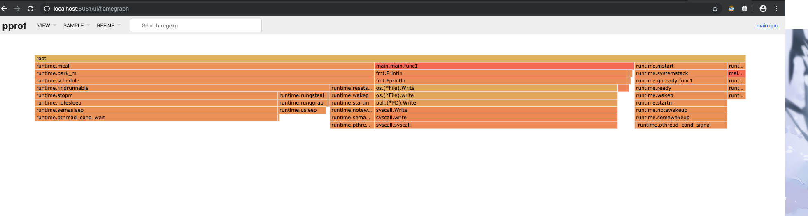

## Go pprof的使用

go编译生成的程序在运行时怎么监控cpu和内存，go自带工具pprof可以完美解决这个问题。

Go中监控代码性能的有两个包：

+ `net/http/pprof`
+ `runtime/pprof`

两者的区别是`net/http/pprof`是通过http端口暴露出来的，内部封装的仍然是`runtime/pprof`。

### 1. 监控CPU

```go
import (
	"flag"
	"fmt"
	"log"
	"os"
	"runtime/pprof"
	"time"
)

func main() {
	cpuProfile := flag.String("cpuProfile", "", "write cpu profile to file")
	flag.Parse()

	if len(*cpuProfile) > 0 {
		cpuFile, err := os.Create(*cpuProfile)
		if err != nil {
			log.Fatalln(err)
		}
		pprof.StartCPUProfile(cpuFile)
		defer pprof.StopCPUProfile()
	}

	c := make(chan int)

	go func() {
		idleDuration := 100 * time.Second
		timer := time.NewTimer(idleDuration)
		defer timer.Stop()
		for {
			timer.Reset(idleDuration)
			select {
			case a := <-c:
				fmt.Println(a)
			case <-timer.C:
				fmt.Println("超时")
			}
		}
	}()

	a := make([]int, 1000000)
	for i := 0; i < 1000000; i++ {
		c <- i
		a[i] = i
	}
	fmt.Println(len(a))
}

```


1. 编译该文件生成可执行文件

2. 运行`./main -cpuProfile=cpu.prof`运行`main`程序并生成`cpu.prof`文件

3. 运行`go tool pprof main cpu.prof`会看到如下图所示：

   

4. 输入`web`（需要安装`graphviz`工具），可在浏览器中查看到如下结果：

   

5. `topN`命令可以查看到程序最耗CPU的调用：

   

- flat、flat% 表示函数在 CPU 上运行的时间以及百分比
- sum% 表示当前函数累加使用 CPU 的比例
- cum、cum%表示该函数以及子函数运行所占用的时间和比例，应该大于等于前两列的值

### 2. 监控内存

```
package main

import (
	"flag"
	"fmt"
	"log"
	"os"
	"runtime/pprof"
	"time"
)

func main() {
	memProfile := flag.String("memProfile", "", "write mem profile to file")
	flag.Parse()

	c := make(chan int)

	go func() {
		for {
			select {
			case a := <-c:
				fmt.Println(a)
			case <-time.After(100 * time.Second):
				fmt.Println("超时")
			}
		}
	}()

	a := make([]int, 1000000)
	for i := 0; i < 1000000; i++ {
		c <- i
		a[i] = i
	}
	fmt.Println(len(a))

	if len(*memProfile) > 0 {
		memFile, err := os.Create(*memProfile)
		if err != nil {
			log.Fatal(err)
		}
		pprof.WriteHeapProfile(memFile)
	}
}

```

1. 编译该文件生成可执行文件

2. 运行`./main -memProfile=mem.prof`运行`main`程序并生成`mem.prof`文件

3. 运行`go tool pprof main mem.prof`会看到如下图所示：

   

4. 输入`web`（需要安装`graphviz`工具），可在浏览器中查看到如下结果：

   

5. `topN`命令可以查看到程序最耗内存的调用：

   


### 3. go-torch

go版本大于等于1.11的可以直接使用`go tool pprof`命令使用to-torch工具，命令格式如下：

```sh
go tool pprof -http=":8081" [可执行文件] [profile]
```

使用之后可在浏览器中看到火焰图及topN命令结果和graph结果等，推荐使用此种方式，展示的结果更直观。

### 4. 火焰图的使用



y 轴表示调用栈，每一层都是一个函数。调用栈越深，火焰就越高，底部就是正在执行的函数，上方都是它的父函数。

x 轴表示抽样数，如果一个函数在 x 轴占据的宽度越宽，就表示它被抽到的次数多，即执行的时间长（或内存使用大小）。注意，x 轴不代表时间，而是所有的调用栈合并后，按字母顺序排列的。

火焰图就是看顶层的哪个函数占据的宽度最大。只要有”平顶”（plateaus），就表示该函数可能存在性能问题。

颜色没有特殊含义，因为火焰图表示的是 CPU 的繁忙程度，所以一般选择暖色调。

- - 鼠标悬浮
    火焰的每一层都会标注函数名，鼠标悬浮时会显示完整的函数名、抽样抽中的次数、占据总抽样次数的百分比
  - 点击放大
    在某一层点击，火焰图会水平放大，该层会占据所有宽度，显示详细信息
  - 搜索
    在搜索框中用户可以输入关键词或正则表达式，所有符合条件的函数名会高亮显示