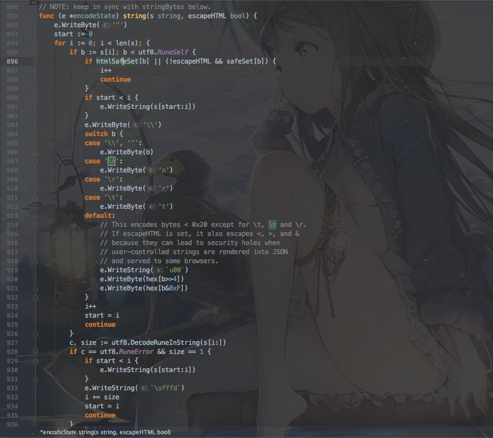

## 1. JSON序列化问题

今天碰到一个bug，从文件中读取一行字符串，调用json.Marshal方法对字符串进行处理后字符串中的`\n`会被转义成`\\n`，查看找到相关源码如下图所示：



在src/encoding/json/encode.go的string()方法中，会将字符串中的`\`转义成`\\`，所以字符串中的`\n`会被转义成`\\n`。

解决方法是将json.Marshal方法处理后的字符串做一次字符串替换，即将字符串中的`\\`替换成`\`。

此外，查阅资料得知，json.Marshal方法还会转义其他特殊字符，如`&`,`<`,`>` 等，如果不希望发生转义则可用如下代码处理：

```go
 bf := bytes.NewBuffer([]byte{})
 jsonEncoder := json.NewEncoder(bf)
 jsonEncoder.SetEscapeHTML(false)
 jsonEncoder.Encode(rsp) // rsp为要处理的字符串
 fmt.Println(bf.String())

```

