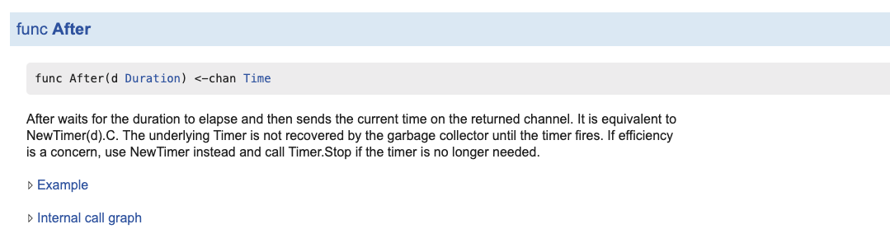
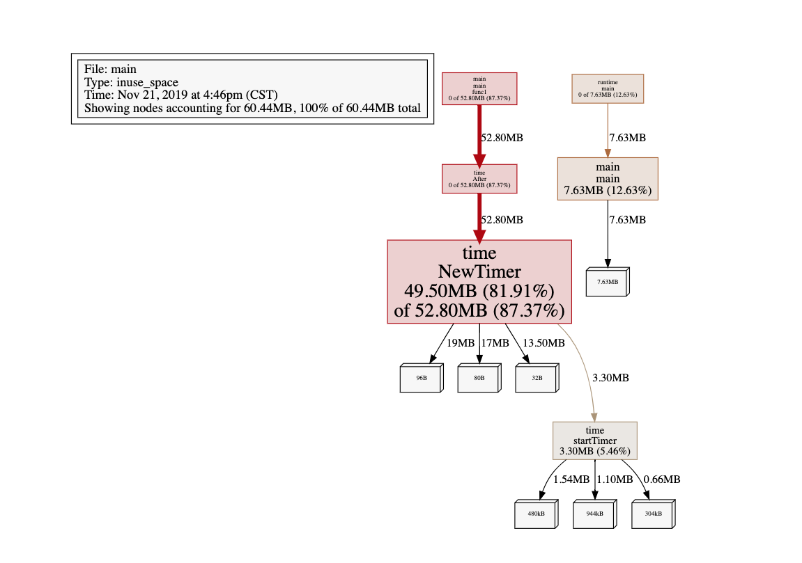
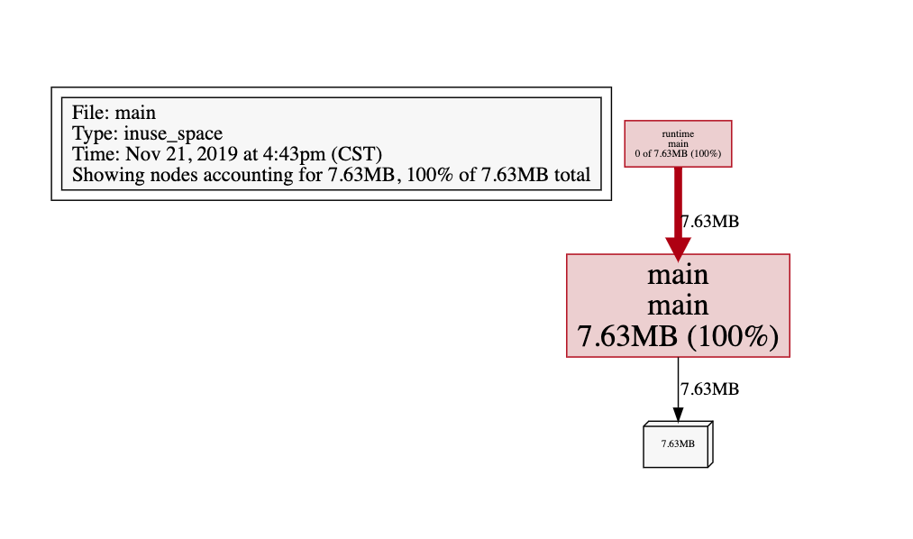

## <-time.After()在计时器过期前不会被垃圾回收

今天浏览技术博客看到一篇文章，因为`time.After()`的使用不当造成了内存泄漏，简单模拟了场景，如下所示：

```go
package main

import (
	"flag"
	"fmt"
	"log"
	"os"
	"runtime/pprof"
	_ "runtime/pprof"
	"time"
)

func main() {
	memProfile := flag.String("memProfile", "", "write mem profile to file")

	flag.Parse()
	f, err := os.Create(*memProfile)
	if err != nil {
		log.Fatal(err)
	}

	c := make(chan int)

	go func() {
		for {
			select {
			case a := <-c:
				fmt.Println(a)
			case <-time.After(100 * time.Second):
				fmt.Println("超时")
			}
		}
	}()
    
    a := make([]int, 1000000)
	for i := 0; i < 1000000; i++ {
		c <- i
		a[i] = i
	}
	fmt.Println(len(a))

	pprof.WriteHeapProfile(f)
}
```


原因是`time.After()`每次调用都会返回一个新的`channel`，把`select+for`的代码拆解一下：

```go
for {
	timeC := time.After(100 * time.Second)
	select {
	case a := <-c:
		fmt.Println(a)
	case <-timeC:
		fmt.Println("超时")
	}
}
```

这样写会造成一个问题，timeC在计时器过期前都不会被gc回收，标准库中有说明：



因此这样会造成内存泄漏。

修改代码如下：

```go
go func() {
	idleDuration := 100 * time.Second
	timer := time.NewTimer(idleDuration)
    defer timer.Stop()
	for {
    	timer.Reset(idleDuration)
		select {
		case a := <-c:
			fmt.Println(a)
		case <-timer.C:
			fmt.Println("超时")
		}
	}
}()
```

这样就会复用`timer.C`，不回造成内存泄漏，一下是我用pprof工具获得的内存使用情况：

在代码未优化前内存使用情况如下图所示：



可以看到`time.NewTimer`占用了很大内存空间。

优化后内存占用情况如下图所示：



`time.NewTimer`占用内存忽略不计了。

相关文章：

[Golang <-time.After（）在计时器过期前不会被垃圾回收](https://studygolang.com/articles/22617#reply0)

[go语言里的select监听到底是怎么工作的?](https://www.zhihu.com/question/340342212/answer/795661248)

